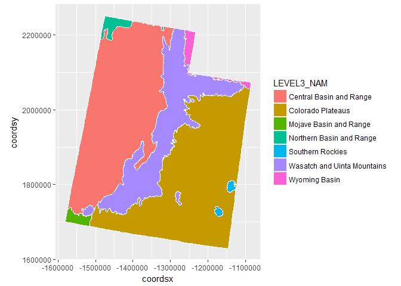

# Plotting Ecoregions
Marc Weber  
March 3, 2017  

## Load in same Utah ecoregions shapefile Hadley uses here [https://github.com/tidyverse/ggplot2/wiki/plotting-polygon-shapefiles](https://github.com/tidyverse/ggplot2/wiki/plotting-polygon-shapefiles)


```r
library(rgdal)
# Get the url for zip file, download and unzip
eco_zip <- 'http://archive.epa.gov/nheerl/arm/web/zip/ecoregion_design.zip'
download.file(eco_zip, 'C:/users/mweber/temp/ecoregion_design.zip')
setwd('C:/users/mweber/temp')
unzip('C:/users/mweber/temp/ecoregion_design.zip')

# Now read into an sp object in R
utah = readOGR(dsn="C:/users/mweber/temp", layer="eco_l3_ut")
```

```
## OGR data source with driver: ESRI Shapefile 
## Source: "C:/users/mweber/temp", layer: "eco_l3_ut"
## with 10 features
## It has 7 fields
```

### Read shapefile into map table in micromap package

```r
require(micromap)
require("ggplot2")
require("plyr")
utah@data$id = rownames(utah@data)
eco_table <- create_map_table(utah, 'id')
head(eco_table)
```

```
##   ID region poly  coordsx coordsy hole plotorder plug
## 1  0      1    1 -1317868 2212461    0         6    0
## 2  0      1    1 -1317854 2212433    0         6    0
## 3  0      1    1 -1317850 2212353    0         6    0
## 4  0      1    1 -1317838 2212351    0         6    0
## 5  0      1    1 -1317822 2212269    0         6    0
## 6  0      1    1 -1317805 2212090    0         6    0
```

```r
names(eco_table)[1] <- 'id'
utah.df = join(eco_table, utah@data, by="id")
```

### Plot with ggplot

```r
ggplot(utah.df) + 
  aes(coordsx,coordsy,group=poly,fill=LEVEL3_NAM) + 
  geom_polygon() +
  geom_path(color="white") +
  coord_equal()  
```

<!-- -->
