# Spatial Data Manipulation, Analysis and Visualization in R: The Basics
Marc Weber  
Wednesday, February 18 2015  

## The Roadmap {.smallest .columns-2}
<div class="notes">
- I've been using R for about a decade, started doing spatial work in R about 5 years ago

- Impetus for doing spatial work in R was documenting workflow in same language most folks I work with use - R

- Now do about 50% or more of spatial work in R, but even when I don't use R, I really do use R - will explain later

- Talk will be a methods talk, not a demonstration of project, will go over a lot of foundation stuff many people may already know or have heard, but will hopefully have some interesting stuff later in talk even for those used to doing spatial work in R
</div>
- Structure of spatial data in R
- Reading / Writing Spatial Data
- Visualizing Spatial Data
- Analysing Spatial Data
- Tools, Tips, Resources


## Explosion of Spatial Packages in R Recently
<div class="centered">
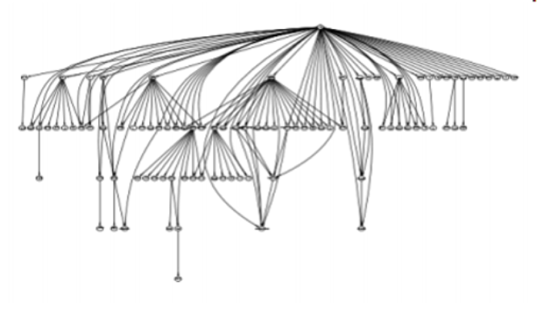 
</div>

- Spatial package dependencies on sp package in R (July 2011) from Roger Bivand talk
http://geostat-course.org/system/files/monday_slides.pdf 

## Get to know sp
<div class="notes">
- sp package is foundation for spatial objects in R, used by most spatial classes

- Key point is that sp uses S4 new style classes 

- S4 classes have formal definitions for components, or slots, that classes contain 

- very useful for spatial objects (i.e. bounding boxes have to have x and y mins an maxes, spatial things have to use CRS, ets)
</div>
<div class="centered">
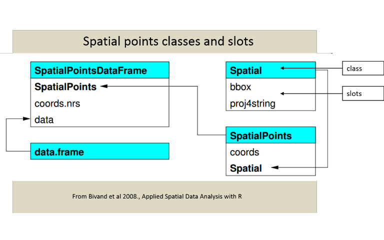 
</div>

## sp slots mirror the structure of ESRI shapefiles
Mandatory Components                                       Optional Components
---------------------------------------------------------  -------------
.shp - actual geometry of feature                          .prj - CRS and projection info in WKT format
.shx - shapef index - binary file giving position index    .sbn and .sbx- spatial indexing files
.dbf - attribute information, stored in dBase IV format    .xml - metadata file

## Get to know sp objects {.smaller .columns-2}
<div class="notes">
- Remember that sp uses new style classes - the class of an object in R determines the method used

- Therefore, we can use plot and summary on sp spatial objects and get appropriate results
</div>

```r
library(rgdal)
data(nor2k)
class(nor2k)
```

```
[1] "SpatialPointsDataFrame"
attr(,"package")
[1] "sp"
```

```r
slotNames(nor2k)
```

```
[1] "data"        "coords.nrs"  "coords"      "bbox"        "proj4string"
```

```r
plot(nor2k, axes=T, main='Peaks in Norway over 2000 meters')
```

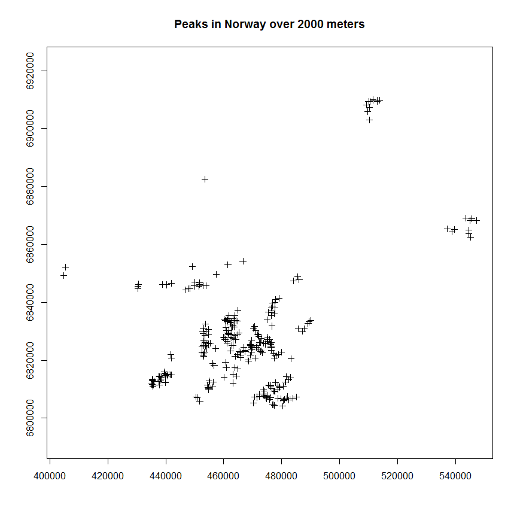

## Get to know sp objects {.smaller}

```r
library(rgdal)
data(nor2k)
summary(nor2k)
```

```
Object of class SpatialPointsDataFrame
Coordinates:
           min     max
East    404700  547250
North  6804200 6910050
Height    2001    2469
Is projected: TRUE 
proj4string :
[+proj=utm +zone=32 +datum=WGS84 +ellps=WGS84 +towgs84=0,0,0]
Number of points: 300
Data attributes:
      Nr.             Navn             Kommune         
 Min.   :  1.00   Length:300         Length:300        
 1st Qu.: 75.75   Class :character   Class :character  
 Median :150.50   Mode  :character   Mode  :character  
 Mean   :150.50                                        
 3rd Qu.:225.25                                        
 Max.   :300.00                                        
```

## Get to know raster {.smallest .columns-2 .build}
<div class="notes">
- A big advantage of the raster package is that it can work with data on disk that's too large to load into memory for R

- raster package creates objects from files that only contain information about the structure of the data, like number of rows and columns, extent, but doesn't try to read all the cell values into memory

- Processes data in chunks when running computations on rasters
</div>
>- sp has spatial grid and pixel classes, but raster package is best for raster data in R
>- Raster data structure divides region into rectangles / cells 
>- Cells can store one or more values for the cells

```r
library(raster)
r <- raster(ncol=10, nrow=10)
values(r) <- c(1:100)
plot(r, main='Raster with 100 cells')
```

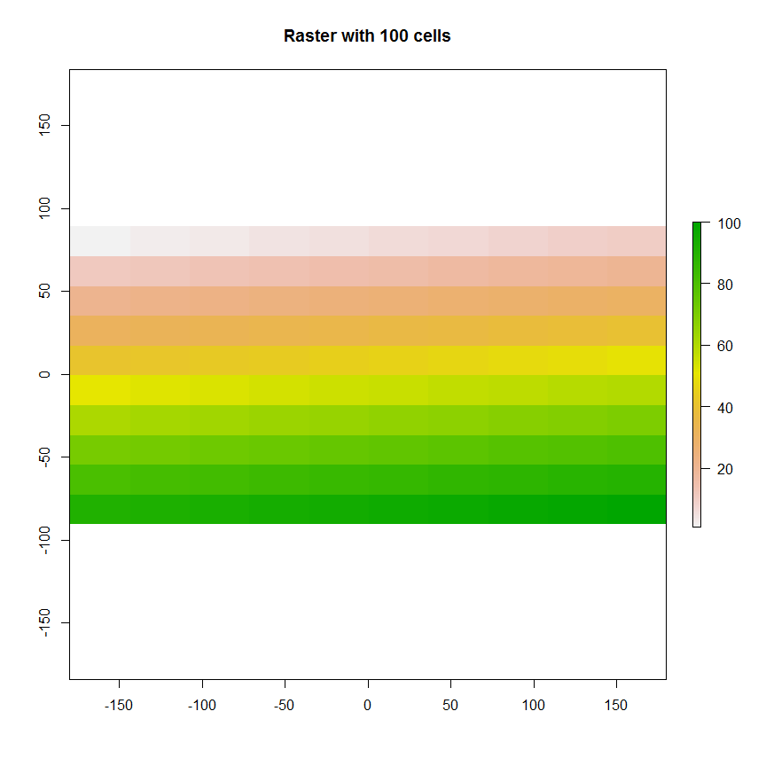

## Making data spatial {.smaller .build}

```r
library(maps);library(sp);require(knitr)
data(us.cities)
knitr::kable(us.cities[1:5,])
```


name         country.etc       pop     lat      long   capital
-----------  ------------  -------  ------  --------  --------
Abilene TX   TX             113888   32.45    -99.74         0
Akron OH     OH             206634   41.08    -81.52         0
Alameda CA   CA              70069   37.77   -122.26         0
Albany GA    GA              75510   31.58    -84.18         0
Albany NY    NY              93576   42.67    -73.80         2

```r
class(us.cities) # simple data frame
```

[1] "data.frame"

## Making data spatial {.smaller .build}
### Promote a data frame with coordinate to an sp SpatialPointsDataFrame

```r
library(maps);library(sp)
data(us.cities)
coordinates(us.cities) <- c("long", "lat") 
class(us.cities) 
```

[1] "SpatialPointsDataFrame"
attr(,"package")
[1] "sp"

```r
plot(us.cities, pch = 20, col = 'forestgreen', axes=T,
     xlim=c(-125,-70), ylim=c(26,55))
```

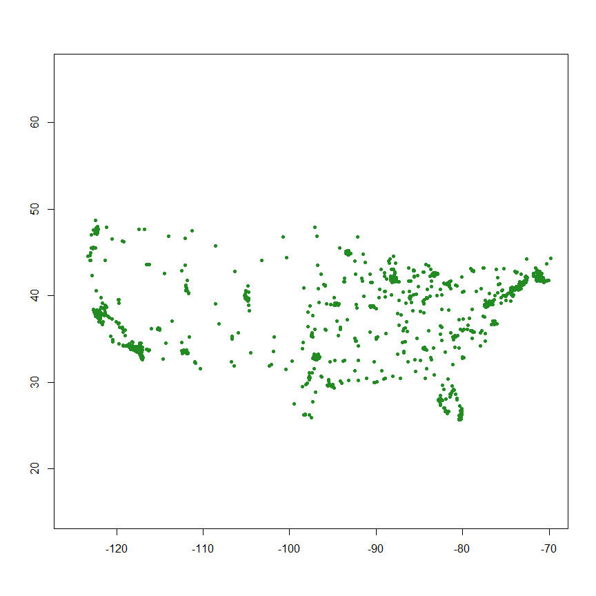

## Maps package provides convenient stock maps {.smaller .columns-2}

```r
library(maps)
par(mfrow=c(1,1))
map()
```

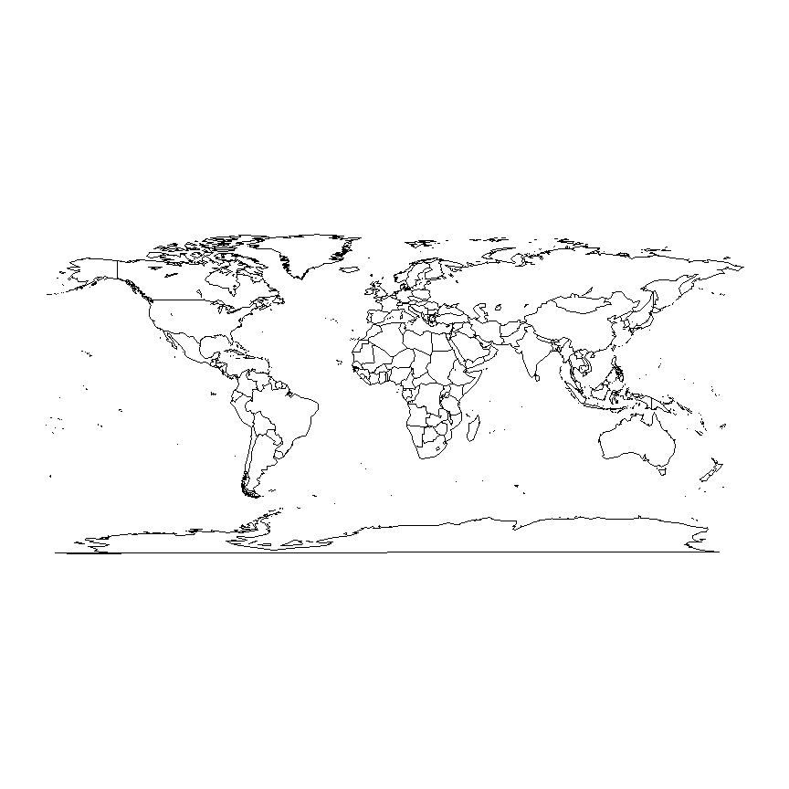

```r
map.text('county','oregon')
map.axes()
title(main="Oregon State")
```

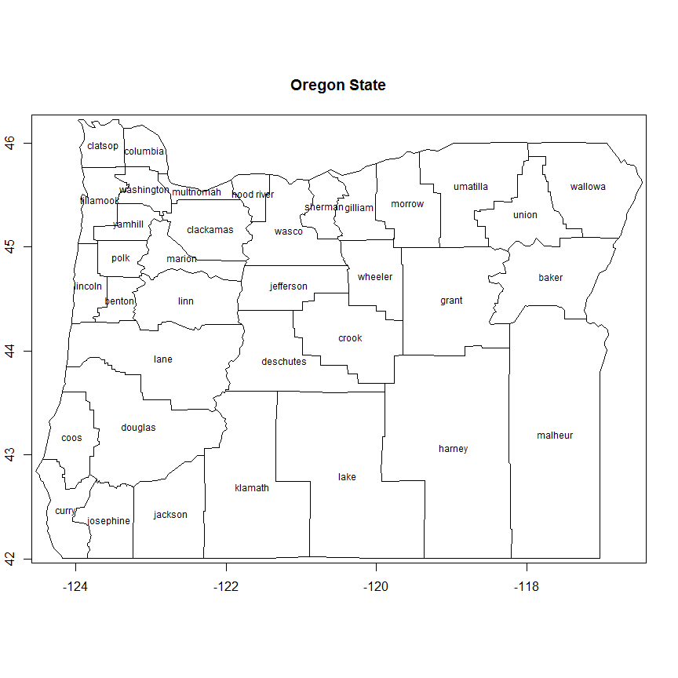

Loading administrative backgrounds from Global Administrative Areas is another good option (http://gadm.org/)

## Dealing with coordinate reference systems in R {.smaller .columns-2}
* CRS can be geographic (lat/lon), projected, or NA in R
* Data with different CRS MUST be transformed to common CRS in R
* Projections in sp are provided in PROJ4 strings in the proj4string slot of an object
* http://www.spatialreference.org/

* Useful rgdal package functions:
    * projInfo(type='datum')
    * projInfo(type='ellps')
    * projInfo(type='proj')


## Dealing with coordinate reference systems in R 
* For sp classes:
    * To get the CRS:  proj4string(x)
    * To assign the CRS:
        * Use either EPSG code or PROJ.4:
            * proj4string(x) <- CRS("init=epsg:4269")
            * proj4string(x) <- CRS("+proj=utm +zone=10 +datum=WGS84")
    * To transform CRS
          * x <- spTransform(x, CRS("+init=epsg:4238"))
          * x <- spTransform(x, proj4string(y))

* For rasters:
    * To get the CRS:  projection(x)
    * To transform CRS:  projectRaster(x)

## Reading and writing spatial data {.build}
- Best method for reading and writing shapefiles is to use readOGR() and writeOGR() in rgdal

```r
library(rgdal)
setwd('K:/GitProjects/RUserWebinar')
HUCs <- readOGR('.','OR_HUC08')
writeOGR(HUCs, '.','HUC', driver='ESRI Shapefile')
```
- Best method for reading and writing rasters is raster package

```r
library(raster)
r <- raster('clay.tif')
# crop it
r <- crop(r, extent(-1000000, 2000000, 100000, 3000000) )
writeRaster(r, 'clay_smaller.tif',format='GTiff')
```

## Understanding slot structure { .build}

```r
require(sp);require(rgeos);load("K:/GitProjects/RUserWebinar/Data.RData")
# A spatial PolygonsDataFrame has 5 slots:
str(HUCs, 2)
```

```
Formal class 'SpatialPolygonsDataFrame' [package "sp"] with 5 slots
  ..@ data       :'data.frame':	91 obs. of  3 variables:
  ..@ polygons   :List of 91
  ..@ plotOrder  : int [1:91] 78 1 32 87 81 24 26 11 38 3 ...
  ..@ bbox       : num [1:2, 1:2] -2297797 2191569 -1576981 2914667
  .. ..- attr(*, "dimnames")=List of 2
  ..@ proj4string:Formal class 'CRS' [package "sp"] with 1 slot
```

## Understanding slot structure { .build}

```r
require(sp);require(rgeos);load("K:/GitProjects/RUserWebinar/Data.RData")
# Each polygon element has 5 of it's own slots - here we look at first one:
str(HUCs@polygons[[1]])[]
```

```
Formal class 'Polygons' [package "sp"] with 5 slots
  ..@ Polygons :List of 1
  .. ..$ :Formal class 'Polygon' [package "sp"] with 5 slots
  .. .. .. ..@ labpt  : num [1:2] -1805054 2272669
  .. .. .. ..@ area   : num 9.13e+09
  .. .. .. ..@ hole   : logi FALSE
  .. .. .. ..@ ringDir: int 1
  .. .. .. ..@ coords : num [1:13339, 1:2] -1782485 -1782433 -1782329 -1782239 -1782084 ...
  ..@ plotOrder: int 1
  ..@ labpt    : num [1:2] -1805054 2272669
  ..@ ID       : chr "0"
  ..@ area     : num 9.13e+09
```

```
NULL
```

## Understanding slot structure {.smaller .build}

```r
require(sp);require(rgeos); load("K:/GitProjects/RUserWebinar/Data.RData")
# Here we get a vector of area for features in HUCs spdf
area(HUCs[1:4,])
```

```
[1] 9128424113 2997942053 6065238017 4861449846
```

```r
# Total Area - gArea function in rgeos gives same result
sum(area(HUCs))
```

```
[1] 312620322426
```

```r
# Area of a particular feature
HUCs@polygons[[1]]@Polygons[[1]]@area
```

```
[1] 9128424113
```

## Getting areas of polygons {.smaller .columns-2 .build}

```r
require(sp);load("K:/GitProjects/RUserWebinar/Data.RData")
plot(HUCs, axes=T, main='HUCs in Oregon')
```

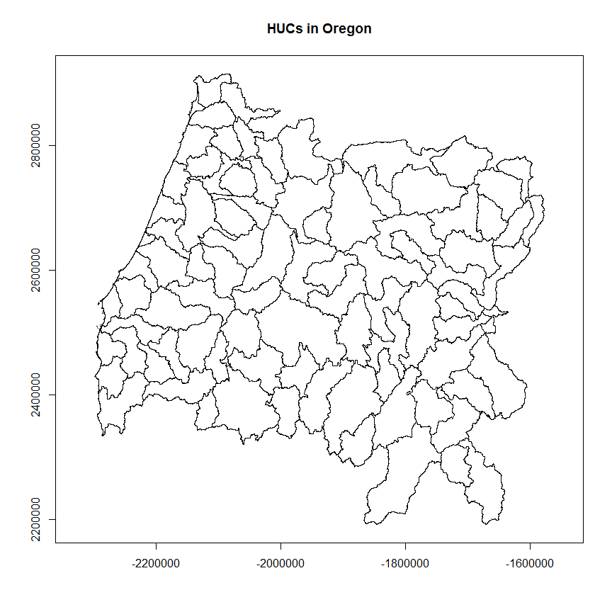

```r
# just plot bigger HUCs
```

```r
require(sp);load("K:/GitProjects/RUserWebinar/Data.RData")
plot(HUCs, axes=T, main='HUCs in Oregon')
# Function to calculate percent of area
AreaPercent <- function(x) {
  tot_area <- sum(sapply(slot(x, "polygons"),
                         slot, "area"))
  sapply(slot(x, "polygons"), slot, 
         "area") / tot_area * 100
}  
# just plot bigger HUCs
plot(HUCs[AreaPercent(HUCs) > 1,], add=T, 
     col='Steel Blue')
```

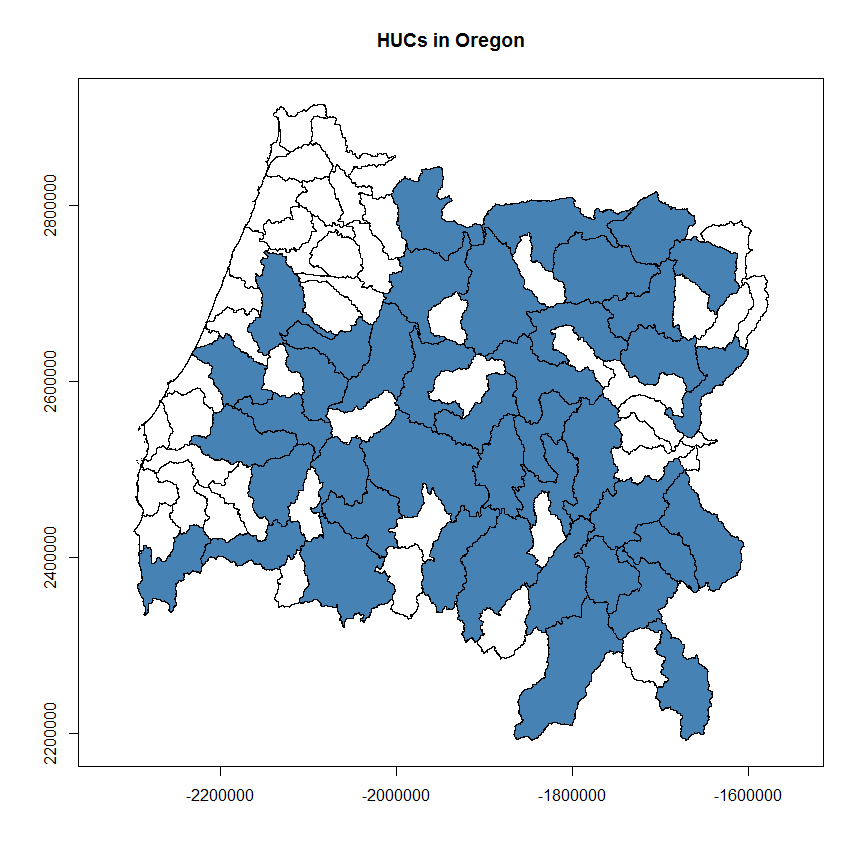

## Spatial Operations on vector data {.build .smaller .columns-2}
<div class="notes">
- First step in any spatial analysis should ALWAYS be setting everything to same CRS
- show code for how I found EPSG code for Oregon Lambert projection!
- Here we use ggplot to plot our gages and color the points by log of flow
</div>

```r
require(ggplot2);load("K:/GitProjects/RUserWebinar/Data.RData")
# Take a look at some USGS stream gages for PNW
gages@data[1:5,5:8]
```

```
##    LON_SITE LAT_SITE    NearCity      AVE
## 1 -123.3178 42.43040 Grants Pass 3402.544
## 2 -122.6011 42.42763 Eagle Point   60.201
## 3 -119.9233 42.42488    Altamont   34.272
## 4 -122.6011 42.40819 Eagle Point  104.177
## 5 -122.5373 42.40263 Eagle Point   72.511
```

```r
# Explicitly set CRS for layers
gages <- spTransform(gages, CRS('+init=epsg:2991'))
# Locations of gages
ggplot(gages@data, aes(LON_SITE, LAT_SITE)) + 
  geom_point(aes(color=log10(AVE)))
```

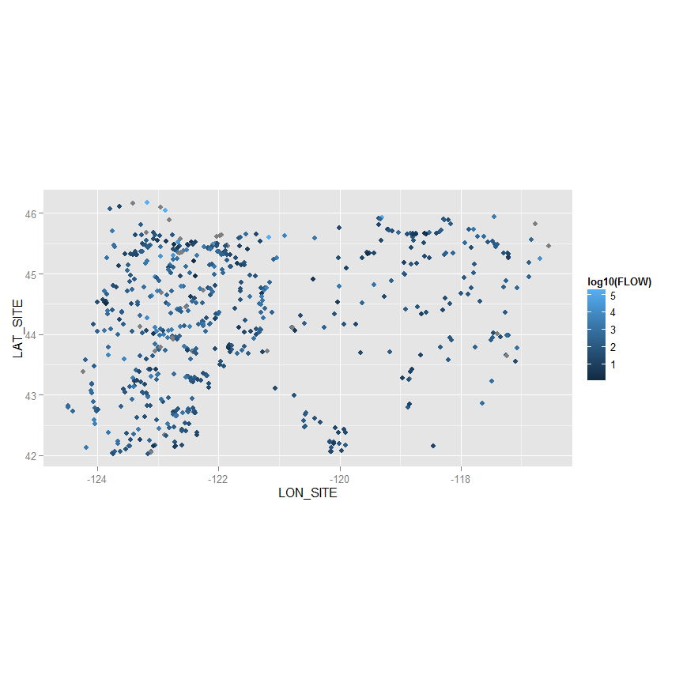

## Spatial Operations on vector data {.build .smaller .columns-2}
### Spatial Indexing

```r
load("K:/GitProjects/RUserWebinar/Data.RData")
gages_proj <- spTransform(gages, CRS('+init=epsg:2991'))
HUCs_proj <- spTransform(HUCs, CRS('+init=epsg:2991'))
HUCs_proj$LON <- coordinates(HUCs_proj)[,1]
HUCs_west <- HUCs_proj[HUCs_proj$LON < 400000, ]
options(scipen=3)
plot(gages_proj, axes=T, col='blue')
plot(HUCs_west, add=T)
```

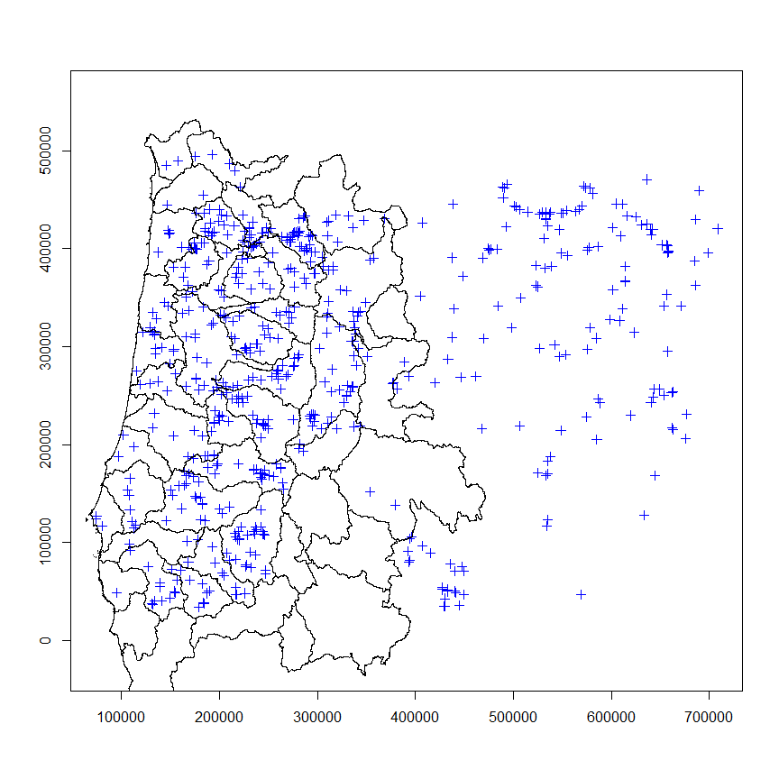

- Just index to subset spatially

```r
load("K:/GitProjects/RUserWebinar/Data.RData")
gages_west <- gages_proj[HUCs_west,]
plot(HUCs_west, axes=T)
plot(gages_west, add=T, col='blue')
```

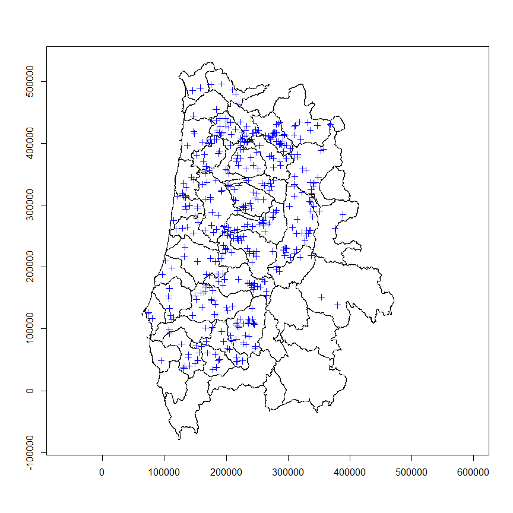

## Spatial operations on vector data {.build}
### Dissolving
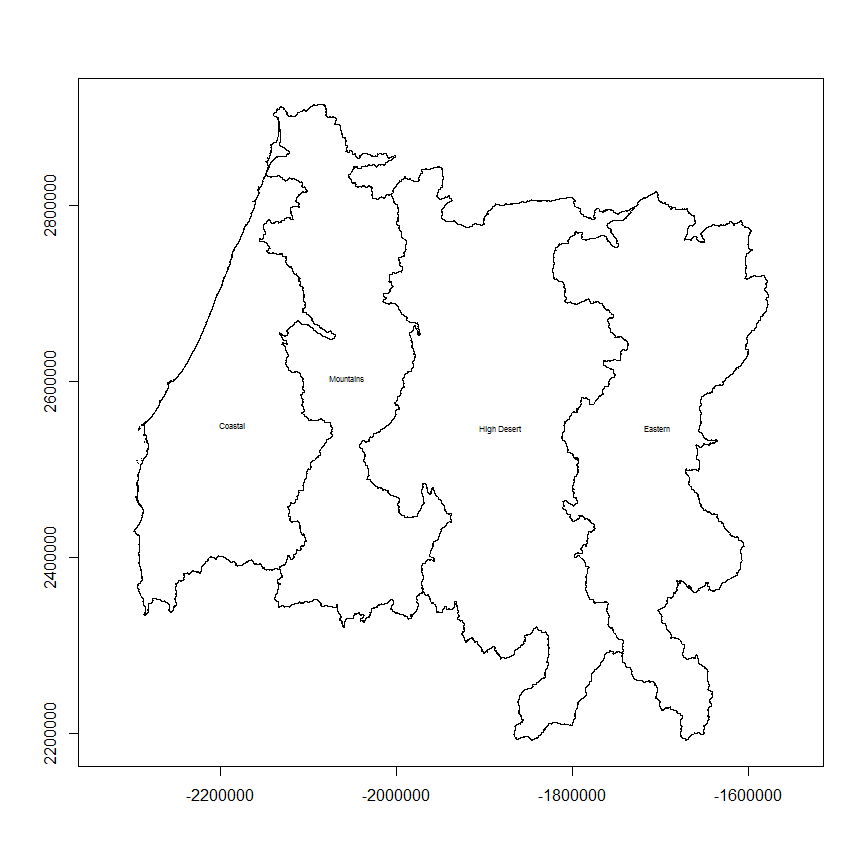


## Spatial Operations on vector data
### Overlay and Aggregation

```r
load("K:/GitProjects/RUserWebinar/Data.RData")
# What regions are stream gages located in?
# We can use sp 'over' function to answer
# remember, must be same CRS!!!
proj4string()
gageHUCs <- over(gages,HUCs) # same as gages %over% HUCs

# simple function for updating our gages spatial data frame with
# result from over
OverUpdate <- function(points, polys) {
  pointpoly <- over(points, polys)
  points@data <- data.frame(points@data, pointpoly)
}

gages <- OverUpdate(gages, HUCs)
} 
head(gages@data)
```

## Attribute joining


## Spdep


## Demo knitr to run R and Python code snippets

```
## OGR data source with driver: ESRI Shapefile 
## Source: "L:/Public/mweber/ORD_Geospatial_R", layer: "OR_HUC8"
## with 91 features and 4 fields
## Feature type: wkbPolygon with 2 dimensions
```

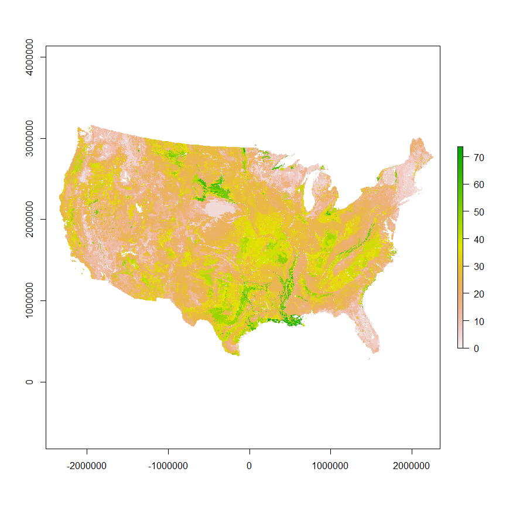 


## Micromap Example like Brazil Murder Rate in SA Paper?

## Visualization - my runs perhaps? 


## This type of visualizsation?

```r
breaks = quantile(volcano, seq(0, 1, length.out=256))
cols = colorRampPalette(c("#55FFFF", "grey10"))(255)
par(mfrow = c(1, 2))
image(volcano, col=cols, axes=F, asp=T)
title(main = "Linear")
image(volcano, col=cols, breaks=breaks, axes=F, asp=T)
title(main = "Quantile")
```

## RGoogleMaps


## Point in poly example as in this example?

```r
# http://www.maths.lancs.ac.uk/~rowlings/Teaching/Sheffield2013/spatialops.html
```

## Resources
- https://github.com/Robinlovelace/Creating-maps-in-R
- https://github.com/Pakillo/R-GIS-tutorial/blob/master/R-GIS_tutorial.md
- http://www.maths.lancs.ac.uk/~rowlings/Teaching/Sheffield2013/spatialops.html
- http://www.maths.lancs.ac.uk/~rowlings/Teaching/UseR2012/cheatsheet.html
