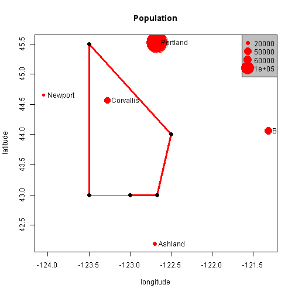
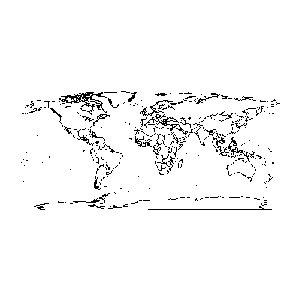
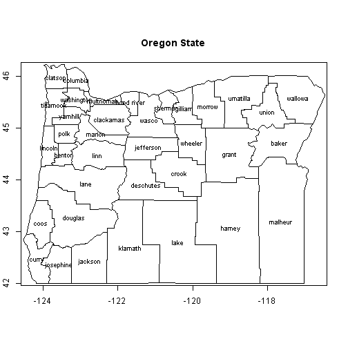
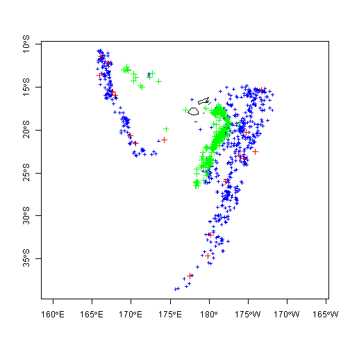
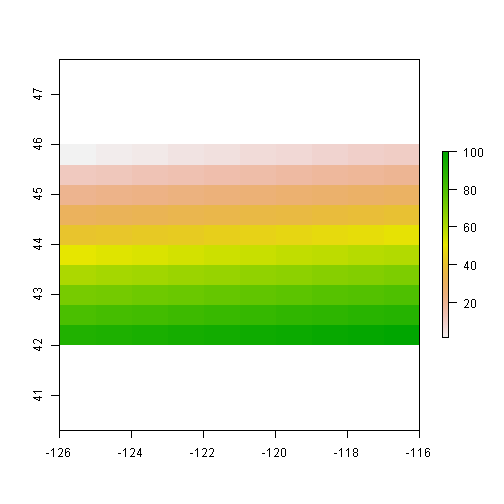
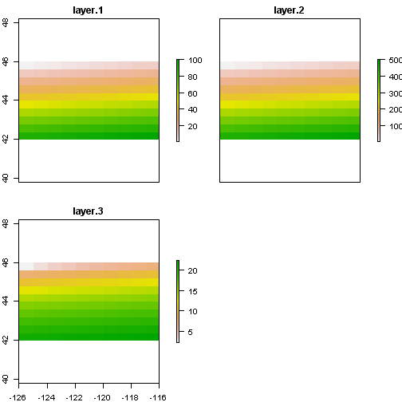

Basic data structures in R can represent spatial data. All we need are some vectors with location and attribute information.

```r
cities <- c("Ashland", "Corvallis", "Bend", "Portland", "Newport")
longitude <- c(-122.699, -123.275, -121.313, -122.67, -124.054)
latitude <- c(42.189, 44.57, 44.061, 45.523, 44.652)
population <- c(20062, 50297, 61362, 537557, 9603)
locs <- cbind(longitude, latitude)
```


Plot locations, with size (cex) proportional to precip

```r
plot(locs, cex = sqrt(population * 2e-04), pch = 20, col = "red", main = "Population")
text(locs, cities, pos = 4)
# add a legend
breaks <- c(20000, 50000, 60000, 1e+05)
legend("topright", legend = breaks, pch = 20, pt.cex = 1 + breaks/20000, col = "red", 
    bg = "gray")
# Add a polygon to our map
lon <- c(-123.5, -123.5, -122.5, -122.67, -123)
lat <- c(43, 45.5, 44, 43, 43)
x <- cbind(lon, lat)
polygon(x, border = "blue")
lines(x, lwd = 3, col = "red")
points(x, cex = 2, pch = 20)
```

 


Packages early on in R came at handling spatial data in their own way - maps package is great example - database of locational information that is quite handy.The maps package format was developed in S (R is implementation of S) - lines represented as a sequence of points separated by 'NA' values - think of as drawing with a pen, raising at NA, then lowering at a value.  Bad for associating with data since objects are only distinguished by separation with NA values.

```r
library(maps)
map()
```

 

```r
map.text("county", "oregon")
map.axes()
title(main = "Oregon State")
```

 


The maptools package provides convenience function for making spatial objects from  map objects.

```r
library(maptools)
counties <- map("county", "oregon", plot = F, col = "transparent", fill = TRUE)
counties$names
```

```
##  [1] "oregon,baker"      "oregon,benton"     "oregon,clackamas" 
##  [4] "oregon,clatsop"    "oregon,columbia"   "oregon,coos"      
##  [7] "oregon,crook"      "oregon,curry"      "oregon,deschutes" 
## [10] "oregon,douglas"    "oregon,gilliam"    "oregon,grant"     
## [13] "oregon,harney"     "oregon,hood river" "oregon,jackson"   
## [16] "oregon,jefferson"  "oregon,josephine"  "oregon,klamath"   
## [19] "oregon,lake"       "oregon,lane"       "oregon,lincoln"   
## [22] "oregon,linn"       "oregon,malheur"    "oregon,marion"    
## [25] "oregon,morrow"     "oregon,multnomah"  "oregon,polk"      
## [28] "oregon,sherman"    "oregon,tillamook"  "oregon,umatilla"  
## [31] "oregon,union"      "oregon,wallowa"    "oregon,wasco"     
## [34] "oregon,washington" "oregon,wheeler"    "oregon,yamhill"
```

```r
# strip out just the county names from items in the names vector of counties
IDs <- sapply(strsplit(counties$names, ","), function(x) x[2])
counties_sp <- map2SpatialPolygons(counties, IDs = IDs, proj4string = CRS("+proj=longlat +ellps=WGS84 +datum=WGS84 +no_defs"))
summary(counties_sp)
```

```
## Object of class SpatialPolygons
## Coordinates:
##      min     max
## x -124.5 -116.47
## y   42.0   46.23
## Is projected: FALSE 
## proj4string :
## [+proj=longlat +ellps=WGS84 +datum=WGS84 +no_defs]
```

```r
plot(counties_sp, col = "grey", axes = TRUE)
```

 


Spatial classes provided in sp package have mostly standardized spatial data in R and provide a solid way to represent and work with spatial data in R.

```r
library(sp)
getClass("Spatial")  #the base spatial class in sp, has a number of subclasses used for spatial objects
```

```
## Class "Spatial" [package "sp"]
## 
## Slots:
##                               
## Name:         bbox proj4string
## Class:      matrix         CRS
## 
## Known Subclasses: 
## Class "SpatialPoints", directly
## Class "SpatialGrid", directly
## Class "SpatialLines", directly
## Class "SpatialPolygons", directly
## Class "SpatialPointsDataFrame", by class "SpatialPoints", distance 2
## Class "SpatialPixels", by class "SpatialPoints", distance 2
## Class "SpatialGridDataFrame", by class "SpatialGrid", distance 2
## Class "SpatialLinesDataFrame", by class "SpatialLines", distance 2
## Class "SpatialPixelsDataFrame", by class "SpatialPoints", distance 3
## Class "SpatialPolygonsDataFrame", by class "SpatialPolygons", distance 2
```

```r
getClass("CRS")  #a character class composed of a projection string in WKT format
```

```
## Class "CRS" [package "sp"]
## 
## Slots:
##                 
## Name:   projargs
## Class: character
```

```r
getClass("SpatialPoints")  #examine the structure of a couple of the subclasses in class 'spatial'
```

```
## Class "SpatialPoints" [package "sp"]
## 
## Slots:
##                                           
## Name:       coords        bbox proj4string
## Class:      matrix      matrix         CRS
## 
## Extends: "Spatial"
## 
## Known Subclasses: 
## Class "SpatialPointsDataFrame", directly
## Class "SpatialPixels", directly
## Class "SpatialPixelsDataFrame", by class "SpatialPixels", distance 2
```

```r
getClass("SpatialLines")
```

```
## Class "SpatialLines" [package "sp"]
## 
## Slots:
##                                           
## Name:        lines        bbox proj4string
## Class:        list      matrix         CRS
## 
## Extends: "Spatial"
## 
## Known Subclasses: "SpatialLinesDataFrame"
```

```r
getClass("SpatialPolygons")
```

```
## Class "SpatialPolygons" [package "sp"]
## 
## Slots:
##                                                       
## Name:     polygons   plotOrder        bbox proj4string
## Class:        list     integer      matrix         CRS
## 
## Extends: "Spatial"
## 
## Known Subclasses: "SpatialPolygonsDataFrame"
```

```r
getClass("SpatialPolygonsDataFrame")
```

```
## Class "SpatialPolygonsDataFrame" [package "sp"]
## 
## Slots:
##                                                                   
## Name:         data    polygons   plotOrder        bbox proj4string
## Class:  data.frame        list     integer      matrix         CRS
## 
## Extends: 
## Class "SpatialPolygons", directly
## Class "Spatial", by class "SpatialPolygons", distance 2
```

```r
getClass("SpatialGrid")
```

```
## Class "SpatialGrid" [package "sp"]
## 
## Slots:
##                                              
## Name:          grid         bbox  proj4string
## Class: GridTopology       matrix          CRS
## 
## Extends: "Spatial"
## 
## Known Subclasses: "SpatialGridDataFrame"
```


Construct a spatial object in R from a data frame with coordinate information - we'll use the built-in dataset 'quakes' with information on earthquakes off the coast of Fiji.  After creating spatial object, promote it to a spatial data frame object.

```r
library(sp)
data(quakes)
head(quakes)
```

```
##      lat  long depth mag stations
## 1 -20.42 181.6   562 4.8       41
## 2 -20.62 181.0   650 4.2       15
## 3 -26.00 184.1    42 5.4       43
## 4 -17.97 181.7   626 4.1       19
## 5 -20.42 182.0   649 4.0       11
## 6 -19.68 184.3   195 4.0       12
```

```r
class(quakes)
```

```
## [1] "data.frame"
```

```r
# Data frames consist of rows of observations on columns of values for
# variables of interest. Create the coordinate reference system to use
llCRS <- CRS("+proj=longlat +datum=NAD83")
# now stitch together the data frame coordinate fields and the projection
# string to createa SpatialPoints object
quakes_sp <- SpatialPoints(quakes[, c("long", "lat")], proj4string = llCRS)
# Summary method gives a description of the spatial object in R. Summary
# works on pretty much all objects in R - for spatial data, gives us basic
# information about the projection, coordinates, and data for an sp object
# if it's a spatial data frame object.
summary(quakes_sp)
```

```
## Object of class SpatialPoints
## Coordinates:
##         min    max
## long 165.67 188.13
## lat  -38.59 -10.72
## Is projected: FALSE 
## proj4string : [+proj=longlat +datum=NAD83]
## Number of points: 1000
```

```r

# We can use the generic plot function in R to produce a quick plot add axes
# as well:
plot(quakes_sp, axes = TRUE, col = "blue", cex = 0.5)  # axes option puts box around region 
# show state borders using maps package - very handy
map("world", "Fiji", fill = FALSE, cex = 2, add = T)

# we can use methods in sp library to extract certain information from
# objects
bbox(quakes_sp)
```

```
##         min    max
## long 165.67 188.13
## lat  -38.59 -10.72
```

```r
proj4string(quakes_sp)
```

```
## [1] "+proj=longlat +datum=NAD83"
```

```r

# now promote the SpatialPoints to a SpatialPointsDataFrame
quakes_coords <- cbind(quakes$long, quakes$lat)
quakes_sp_df <- SpatialPointsDataFrame(quakes_coords, quakes, proj4string = llCRS, 
    match.ID = TRUE)
summary(quakes_sp_df)  # attributes folded back in
```

```
## Object of class SpatialPointsDataFrame
## Coordinates:
##              min    max
## coords.x1 165.67 188.13
## coords.x2 -38.59 -10.72
## Is projected: FALSE 
## proj4string : [+proj=longlat +datum=NAD83]
## Number of points: 1000
## Data attributes:
##       lat             long         depth          mag      
##  Min.   :-38.6   Min.   :166   Min.   : 40   Min.   :4.00  
##  1st Qu.:-23.5   1st Qu.:180   1st Qu.: 99   1st Qu.:4.30  
##  Median :-20.3   Median :181   Median :247   Median :4.60  
##  Mean   :-20.6   Mean   :179   Mean   :311   Mean   :4.62  
##  3rd Qu.:-17.6   3rd Qu.:183   3rd Qu.:543   3rd Qu.:4.90  
##  Max.   :-10.7   Max.   :188   Max.   :680   Max.   :6.40  
##     stations    
##  Min.   : 10.0  
##  1st Qu.: 18.0  
##  Median : 27.0  
##  Mean   : 33.4  
##  3rd Qu.: 42.0  
##  Max.   :132.0
```

```r
str(quakes_sp_df, max.level = 2)
```

```
## Formal class 'SpatialPointsDataFrame' [package "sp"] with 5 slots
##   ..@ data       :'data.frame':	1000 obs. of  5 variables:
##   ..@ coords.nrs : num(0) 
##   ..@ coords     : num [1:1000, 1:2] 182 181 184 182 182 ...
##   .. ..- attr(*, "dimnames")=List of 2
##   ..@ bbox       : num [1:2, 1:2] 165.7 -38.6 188.1 -10.7
##   .. ..- attr(*, "dimnames")=List of 2
##   ..@ proj4string:Formal class 'CRS' [package "sp"] with 1 slots
```

```r
# now that we've associated data with the points, we can select and plot
# using the attributes of the data
plot(quakes_sp_df[quakes_sp_df$mag > 5.5, ], add = TRUE, col = "Red")  # plot just higher magnitued quakes in red
plot(quakes_sp_df[quakes_sp_df$depth > 500, ], add = TRUE, col = "Green")  # plot just dpper quakes in green
```

 

Intro to raster data with raster package:

```r
library(raster)
# create an empty raster
r <- raster(ncol = 10, nrow = 10, xmx = -116, xmn = -126, ymn = 42, ymx = 46)
str(r, max.level = 2)
```

```
## Formal class 'RasterLayer' [package "raster"] with 12 slots
##   ..@ file    :Formal class '.RasterFile' [package "raster"] with 13 slots
##   ..@ data    :Formal class '.SingleLayerData' [package "raster"] with 13 slots
##   ..@ legend  :Formal class '.RasterLegend' [package "raster"] with 5 slots
##   ..@ title   : chr(0) 
##   ..@ extent  :Formal class 'Extent' [package "raster"] with 4 slots
##   ..@ rotated : logi FALSE
##   ..@ rotation:Formal class '.Rotation' [package "raster"] with 2 slots
##   ..@ ncols   : int 10
##   ..@ nrows   : int 10
##   ..@ crs     :Formal class 'CRS' [package "sp"] with 1 slots
##   ..@ history : list()
##   ..@ z       : list()
```

```r
r
```

```
## class       : RasterLayer 
## dimensions  : 10, 10, 100  (nrow, ncol, ncell)
## resolution  : 1, 0.4  (x, y)
## extent      : -126, -116, 42, 46  (xmin, xmax, ymin, ymax)
## coord. ref. : +proj=longlat +datum=WGS84
```

```r
r[] <- 1:ncell(r)
r
```

```
## class       : RasterLayer 
## dimensions  : 10, 10, 100  (nrow, ncol, ncell)
## resolution  : 1, 0.4  (x, y)
## extent      : -126, -116, 42, 46  (xmin, xmax, ymin, ymax)
## coord. ref. : +proj=longlat +datum=WGS84 
## data source : in memory
## names       : layer 
## values      : 1, 100  (min, max)
```

```r
plot(r)
```

 

```r

# a raster stack is a raster with multiple raster layers
r2 <- r * 50
r3 <- sqrt(r * 5)
s <- stack(r, r2, r3)
s
```

```
## class       : RasterStack 
## dimensions  : 10, 10, 100, 3  (nrow, ncol, ncell, nlayers)
## resolution  : 1, 0.4  (x, y)
## extent      : -126, -116, 42, 46  (xmin, xmax, ymin, ymax)
## coord. ref. : +proj=longlat +datum=WGS84 
## names       : layer.1, layer.2, layer.3 
## min values  :   1.000,  50.000,   2.236 
## max values  :  100.00, 5000.00,   22.36
```

```r
plot(s)
```

 

